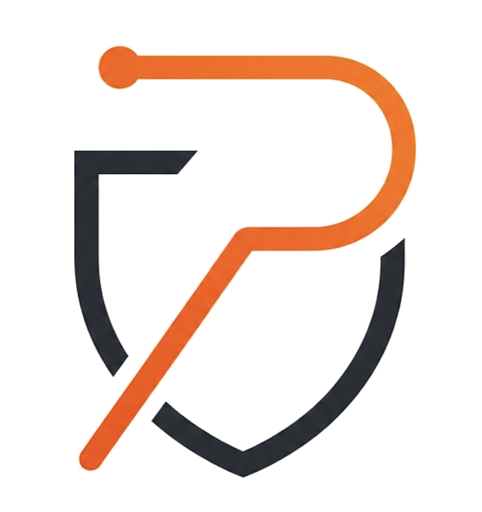

<div align="center">



# Pencheff Community Edition

### The self-hostable, no-login AI penetration-testing platform

Point it at a target, describe the engagement in plain language, and let it run reconnaissance, vulnerability scanning, exploit-chain analysis, and reporting — entirely on your own infrastructure.

[](LICENSE)
[](#-quick-start)
[-blueviolet?style=flat-square>)](#-community-edition-scope)
[](#-quick-start)
[](#-architecture)
[](#-architecture)
[](#-target-types)
[](#-use-it-from-an-ai-agent-mcp)

[Quick Start](#-quick-start) · [Capabilities](#-whats-inside) · [Target Types](#-target-types) · [Architecture](#-architecture) · [AI / MCP](#-use-it-from-an-ai-agent-mcp) · [Configuration](#-configuration) · [Scope](#-community-edition-scope)

</div>

> **🛡️ Community Edition** — This is the open-source, single-user build of Pencheff. No accounts, no login, no billing, no multi-tenancy. You own the box, you own the data. **Use it only against systems you are authorized to test.**

---

## ✨ What it is

Pencheff CE is a complete offensive-security platform you run yourself with **one command**. There's no sign-up and no login screen — `docker compose up`, open `http://localhost:3000`, and you land straight on the dashboard.

It pairs a **deterministic scan engine** (the same reconnaissance, fuzzing, and exploitation primitives a pentester reaches for) with **optional AI orchestration** (bring your own LLM key) that triages findings, proposes fixes, and can drive autonomous assessment passes. Without an LLM key, every scan, finding, and report still works — the AI paths simply stay dark.

- 🔓 **Zero-auth, single-user** — one implicit operator, no orgs/teams/SSO.
- 🧰 **Full engine** — recon → scan → verify → exploit-chain → report, end to end.
- 🤖 **Bring-your-own AI** — optional LLM-assisted triage, grading, and remediation.
- 🔌 **Agent-native** — drive the whole platform from any MCP-capable AI agent.
- 🐳 **One-command deploy** — Docker Compose brings up the entire stack.
- 📜 **Apache-2.0** — fork it, ship it, run it anywhere.

---

## 🚀 Quick Start

```bash
# 1. Clone
git clone https://github.com/balasriharsha/pencheff-ce.git
cd pencheff-ce

# 2. Copy the environment templates (defaults work out of the box)
cp .env.example .env
cp apps/api/.env.example apps/api/.env

# 3. Bring up the whole stack
docker compose up --build

# 4. Open the app — no login, straight to the dashboard
open http://localhost:3000
```

That's it. The `FERNET_KEY` auto-generates on first boot, migrations run automatically, and a single workspace is seeded for you. Verify everything is healthy any time with:

```bash
./scripts/smoke.sh   # asserts /targets and /dashboard return 200
```

> **Want AI features?** Drop an `LLM_API_KEY` into `apps/api/.env` (see [Configuration](#-configuration)). Everything else runs without one.

---

## 🧩 What's inside

The full scan surface, organized by capability. Coverage is computed live on the **`/scans`** dashboard from your real activity.

| Capability            | What it does                                                                                       |
| --------------------- | -------------------------------------------------------------------------------------------------- |
| 🌐 **Recon**          | Passive + active reconnaissance, API discovery, subdomain enumeration, asset mapping               |
| ⚡ **DAST**           | Live web-app scanning — OWASP Top 10, injection, auth/authz, business-logic, client-side & DOM XSS |
| `</>` **SAST**        | Source-code analysis via Semgrep across cloned repositories                                        |
| 🔑 **Secrets**        | Hardcoded-credential and secret detection (Gitleaks)                                               |
| 📦 **SCA**            | Dependency / advisory scanning (OSV + GitHub Advisory DB) with SBOM ingest                         |
| 📚 **IaC**            | Terraform / Kubernetes misconfiguration scanning (Trivy, Checkov)                                  |
| 🧊 **Container**      | Container-image CVE & misconfig scanning                                                           |
| 🧠 **LLM Red Team**   | Prompt-injection, jailbreak, and safety testing for LLM-backed targets                             |
| 🛠️ **Manual tooling** | Burp-style **Repeater**, **Intruder** (fuzzing), and an intercepting **Proxy**                     |
| 📡 **OAST**           | Out-of-band callback testing for blind SSRF / RCE / injection                                      |
| 🧮 **Scoring**        | CVSS v4.0 calculation and severity grading                                                         |
| 🤖 **Agentic Fix**    | AI-proposed remediations and patch suggestions (optional LLM)                                      |
| 📄 **Reporting**      | Export findings to Word, Markdown, CSV, and JSON                                                   |
| ⏱️ **Schedules**      | Recurring, on-demand scan scheduling                                                               |

---

## 🎯 Target types

Register and scan **13 distinct target types** — each with its own purpose-built scan pipeline:

|                      |                     |                       |                |
| -------------------- | ------------------- | --------------------- | -------------- |
| 🌐 `web_app`         | 🔗 `rest_api`       | ◢ `graphql`           | 🔌 `websocket` |
| 📞 `grpc`            | `</>` `source_code` | ⚙️ `cicd_pipeline`    | 📚 `iac`       |
| 🧊 `container_image` | ☸️ `k8s_cluster`    | 📦 `package_registry` | 📋 `sbom`      |
| 🧠 `llm`             |                     |                       |                |

---

## 🏗️ Architecture

```
docker compose
├── web      Next.js app on :3000  ── dashboard, no login, dynamic routing
├── api      FastAPI on :8000      ── REST + WebSocket + SSE
├── worker   Celery worker         ── scan jobs & long-running tasks
├── postgres pgvector              ── primary data store
└── redis                          ── task queue + pub/sub
```

| Service      | Port   | Role                                                  |
| ------------ | ------ | ----------------------------------------------------- |
| **web**      | `3000` | Next.js frontend — lands on the dashboard, no auth    |
| **api**      | `8000` | FastAPI backend — REST, WebSocket, Server-Sent Events |
| **worker**   | —      | Celery worker — executes scans and background jobs    |
| **postgres** | `5432` | Primary datastore (pgvector image)                    |
| **redis**    | `6379` | Job queue and pub/sub                                 |

The browser talks to the API directly (CORS is preconfigured for `localhost:3000`); the worker pulls scan jobs off Redis and streams progress back over SSE/WebSocket.

---

## 🤖 Use it from an AI agent (MCP)

Pencheff ships an **MCP server with 50+ security tools** — recon, scanning across every discipline, payload generation, OAST, exploit-chain suggestion, CVSS scoring, finding verification, and report export. Point any MCP-capable agent (Claude Code, Claude Desktop, or your own) at it and drive a full engagement conversationally:

```
You:   "Recon example.com, then run an injection + auth scan and chain anything you find."
Agent: pentest_init → recon_passive → recon_active → scan_injection → scan_auth
       → exploit_chain_suggest → test_chain → verify_finding → generate_report
```

A representative slice of the toolset: `pentest_init` · `recon_active` · `scan_injection` · `scan_auth` · `scan_cloud` · `scan_websocket` · `payload_generate` · `oast_poll` · `exploit_chain_suggest` · `test_endpoint` · `calculate_cvss40` · `verify_finding` · `export_report`.

---

## ⚙️ Configuration

Everything is configured through environment variables in `.env` (root) and `apps/api/.env`. Sensible defaults ship in the `*.env.example` files.

<table>
<tr><th>Setting</th><th>Default</th><th>Purpose</th></tr>
<tr><td><code>LLM_API_KEY</code></td><td><em>(unset)</em></td><td>Enables AI triage, grading, agentic fixes, and autonomous scanning. Optional — pair with <code>LLM_BASE_URL</code> / <code>LLM_MODEL</code>.</td></tr>
<tr><td><code>INTEGRATIONS_ENABLED</code></td><td><code>false</code></td><td>Turns on outbound integrations (GitHub, webhooks, etc.).</td></tr>
<tr><td><code>OBSERVABILITY_INGEST_ENABLED</code></td><td><code>false</code></td><td>Turns on OpenTelemetry / OTLP trace ingest.</td></tr>
<tr><td><code>FERNET_KEY</code></td><td><em>auto</em></td><td>Encrypts stored credentials. Auto-generated on first boot; set it explicitly to persist across rebuilds.</td></tr>
</table>

Check which AI features are live at any time:

```bash
curl http://localhost:8000/capabilities/ai      # → {"available": true|false}
```

---

## 📦 Community Edition scope

This build is deliberately lean and single-tenant. The following are **intentionally not included**:

- ❌ Authentication / login / SSO (one implicit operator)
- ❌ Multi-tenant orgs, teams, or workspace management
- ❌ Billing, plans, or usage metering
- ❌ Engagement workbench (multi-analyst campaign tracking)
- ❌ Compliance-framework mapping & reporting
- ❌ Hosted/SaaS integrations that require paid back-ends (off by default)

What you get instead: the complete scanning engine, the full local dashboard, the MCP toolset, and reporting — yours to run, fork, and extend.

---

## 🛠️ Tech stack


---

## ⭐ Star history

<a href="https://star-history.com/#balasriharsha/pencheff-ce&Date">
  
</a>

---

## ⚖️ Legal & responsible use

Pencheff is an **offensive-security tool**. Only scan, probe, or exploit systems you own or have **explicit written authorization** to test. Unauthorized use may be illegal. You are responsible for how you use it.

## 📄 License

Licensed under the **Apache License, Version 2.0** — see [LICENSE](LICENSE). Third-party component notices are in [THIRD_PARTY_NOTICES.md](THIRD_PARTY_NOTICES.md).

<div align="center">

**If Pencheff CE is useful to you, consider giving it a ⭐**

[⭐ Star](https://github.com/balasriharsha/pencheff-ce) · [🍴 Fork](https://github.com/balasriharsha/pencheff-ce/fork) · [🐛 Issues](https://github.com/balasriharsha/pencheff-ce/issues)

<sub>© 2026 Magadha Group · Apache-2.0 · Built for self-hosted security work.</sub>

</div>
